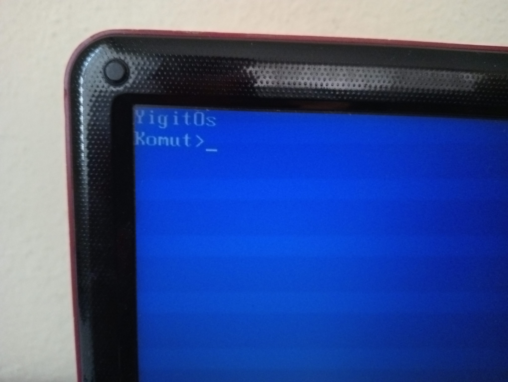

# YigitOs
Bu benim ilk işletim sistemi çalışmam. Bu işletim sistemi klavye girişini algılayan bir kernel ve küçük bir shell bulunmakta, sadece 512 byte ile çalışan bir bootloader.

## DD ile Usb'ye yazdırmak:

lsblk komutu ile belleğin adını öğrenin(sakın yanlış diski seçmeyin)

  <button style="position:absolute; top:5px; right:5px; background-color:#fff; border:none; color:#000; padding:5px 10px; border-radius:3px;" onclick="navigator.clipboard.writeText('lsblk')"></button>
  <pre><code>lsblk</code></pre>

  <button style="position:absolute; top:5px; right:5px; background-color:#fff; border:none; color:#000; padding:5px 10px; border-radius:3px;" onclick="navigator.clipboard.writeText('sudo dd if=YigitOs.bin of=/dev/(disk adı)')"></button>
  <pre><code>sudo dd if=YigitOs.bin of=/dev/(disk adı)</code></pre>

